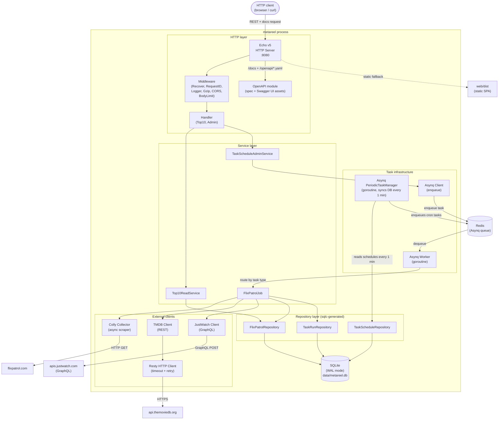
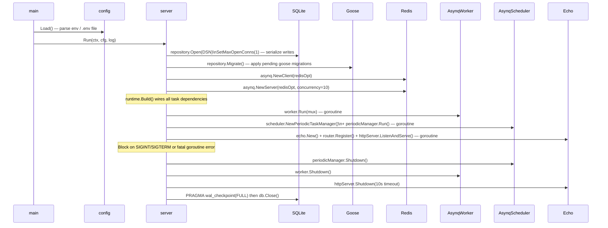
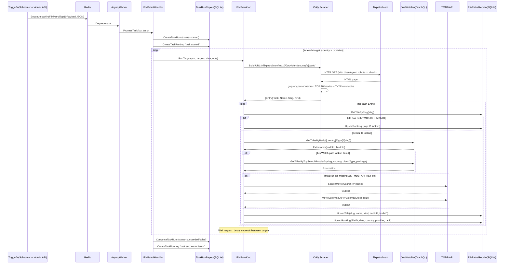
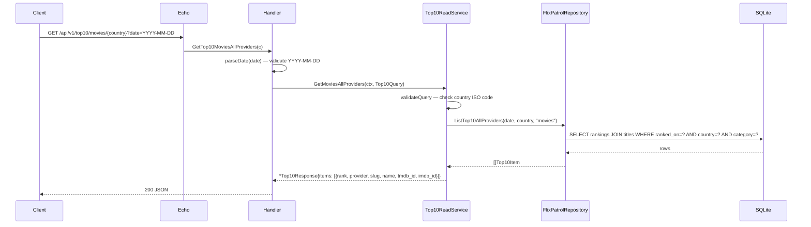
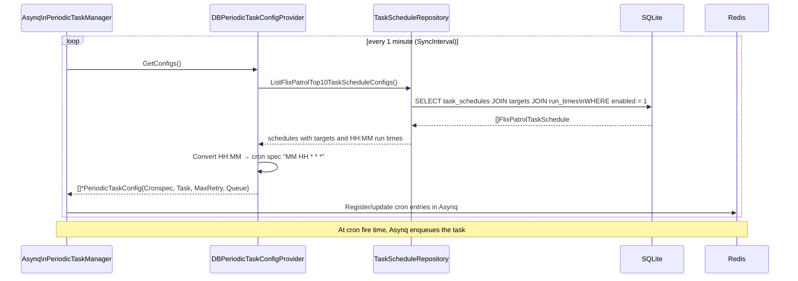
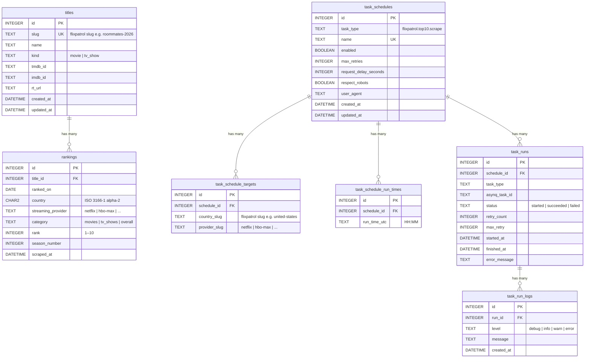

# metareel — Architecture

## Overview

metareel is a Go backend service that scrapes daily Top 10 streaming rankings from [FlixPatrol](https://flixpatrol.com), enriches each title with TMDB and IMDb IDs (via the TMDB API and the JustWatch GraphQL API), persists the data in a SQLite database, and exposes a JSON REST API for querying rankings by country and streaming provider.

The HTTP contract is defined by embedded OpenAPI specs (`/openapi/public.yaml` and `/openapi/admin.yaml`) and served through Swagger UI (`/docs` and `/docs/admin`).

The service runs three concurrent subsystems in a single process:

| Subsystem | Role |
|---|---|
| **Echo HTTP server** | Serves the read API and admin endpoints |
| **Asynq worker** | Processes background scrape jobs pulled from Redis |
| **Asynq periodic task manager** | Reads cron schedules from the DB and enqueues jobs automatically |

---

## Component Architecture



---

## Startup & Initialization Flow



---

## Scrape Job Flow (the core data pipeline)

This is the primary data ingestion path. It can be triggered in two ways:
- **Automatically** by the Asynq PeriodicTaskManager on configured cron schedules
- **Manually** via `POST /api/v1/admin/task-schedules/:id/run-now`



---

## Read API Flow



---

## Periodic Schedule Sync Flow

The PeriodicTaskManager polls the DB every minute and adjusts the Asynq cron schedule dynamically, without restarts.



---

## Database Schema

Six tables in a single SQLite file (`data/metareel.db`, WAL mode).



Key constraints:
- `rankings` has a unique index on `(ranked_on, country, streaming_provider, category, rank)` — upserts replace stale title references cleanly.
- `titles` is keyed on `slug` (FlixPatrol URL slug). TMDB/IMDb IDs are filled in lazily and only overwrite `NULL`.
- `task_schedules.name` is unique — the admin API returns `409 Conflict` on duplicates.
- SQLite connection pool is capped at 1 (`SetMaxOpenConns(1)`) to serialize writes; WAL mode allows concurrent reads alongside the single writer.

---

## API Contract

The API reference is OpenAPI-first and is not duplicated in this architecture document.

- Public spec (YAML): `GET /openapi/public.yaml`
- Admin spec (YAML): `GET /openapi/admin.yaml`
- Public Swagger UI: `GET /docs`
- Admin Swagger UI: `GET /docs/admin`

Implementation note: both YAML specs and Swagger UI HTML are embedded from `internal/openapi/` into the server binary.

---

## Direct Dependencies

### Runtime dependencies (`go.mod` direct requires)

| Package | Version | Role |
|---|---|---|
| `github.com/labstack/echo/v5` | v5.1.0 | HTTP server and router |
| `github.com/hibiken/asynq` | v0.26.0 | Redis-backed background task queue and scheduler |
| `github.com/redis/go-redis/v9` | v9.18.0 | Redis client (used by `asynq` and the cache wrapper) |
| `github.com/gocolly/colly/v2` | v2.3.0 | Web scraping framework (async, robots.txt, rate limiting) |
| `github.com/PuerkitoBio/goquery` | v1.11.0 | jQuery-style HTML parsing (used inside Colly callbacks) |
| `github.com/go-resty/resty/v2` | v2.17.2 | HTTP client with retry and timeout for external REST APIs |
| `github.com/hasura/go-graphql-client` | v0.16.0 | GraphQL client for the JustWatch API |
| `modernc.org/sqlite` | v1.49.1 | Pure-Go SQLite driver (no CGO — enables fully static binary) |
| `github.com/pressly/goose/v3` | v3.27.0 | SQL migration runner (up/down, versioned files) |
| `github.com/caarlos0/env/v11` | v11.4.0 | Struct-tag-based environment variable parsing |
| `github.com/joho/godotenv` | v1.5.1 | Loads `.env` file into the process environment at startup |

### Dev-only dependencies (`tools/go.mod`)

| Package | Role |
|---|---|
| `github.com/air-verse/air` | Hot-reload server (`make dev-server-air`) |
| `github.com/go-delve/delve` | Local debugger backend for attach/launch workflows |
| `github.com/hibiken/asynqmon` | Web UI for inspecting Asynq queues (`make dev-asynqmon`) |
| `github.com/alicebob/miniredis/v2` | In-process Redis for local dev (`make dev-redis-up`) |

### Code generation tools (installed via `make tools`)

| Tool | Role |
|---|---|
| `github.com/sqlc-dev/sqlc` | Generates type-safe Go from `db/queries/*.sql` |
| `github.com/pressly/goose/v3` CLI | Runs migrations from the terminal (`make migrate-*`) |

### Standard library packages used

`context`, `database/sql`, `encoding/json`, `log/slog`, `net/http`, `os`, `os/signal`, `sync`, `syscall`, `time`

---

## Configuration Reference

All config is loaded from environment variables (with `.env` auto-loaded in development). See `.env.example` for the complete list.

| Variable | Default | Description |
|---|---|---|
| `APP_ENV` | `development` | Environment tag |
| `SERVER_HOST` | `0.0.0.0` | Bind address |
| `SERVER_PORT` | `8080` | Listen port |
| `SERVER_READ_TIMEOUT` | `15s` | Echo read timeout |
| `SERVER_WRITE_TIMEOUT` | `15s` | Echo write timeout |
| `SERVER_SHUTDOWN_TIMEOUT` | `10s` | Graceful shutdown window |
| `LOG_LEVEL` | `info` | `debug` / `info` / `warn` / `error` |
| `DATABASE_URL` | `file:./data/metareel.db?...` | SQLite DSN (WAL + busy timeout + FK enforcement) |
| `DATABASE_MIGRATIONS_DIR` | `db/migrations` | Goose migrations directory |
| `REDIS_ADDR` | `localhost:6379` | Redis address |
| `REDIS_PASSWORD` | _(empty)_ | Redis auth password |
| `REDIS_DB` | `0` | Redis logical DB index |
| `REDIS_DEFAULT_TTL` | `5m` | Default cache TTL |
| `ASYNQ_QUEUE` | `default` | Asynq queue name |
| `ASYNQ_CONCURRENCY` | `10` | Asynq worker goroutine count |
| `HTTP_CLIENT_TIMEOUT` | `20s` | Resty request timeout |
| `HTTP_CLIENT_RETRY_COUNT` | `2` | Resty auto-retry count on 5xx / network error |
| `HTTP_CLIENT_USER_AGENT` | `metareel/0.1` | User-Agent for TMDB + JustWatch requests |
| `SCRAPER_USER_AGENT` | `metareel-bot/0.1` | Colly User-Agent header |
| `SCRAPER_PARALLELISM` | `4` | Colly concurrent requests per domain |
| `SCRAPER_REQUEST_TIMEOUT` | `20s` | Colly per-request timeout |
| `UI_STATIC_DIR` | `web/dist` | Directory to serve the SPA from |
| `UI_SERVE_STATIC` | `true` | Enable / disable static file serving |
| `TMDB_API_KEY` | _(empty)_ | TMDB v3 API key — ID enrichment disabled when blank |

---

## Project Layout

```
metareel/
├── cmd/
│   └── server/
│       └── main.go               # Entrypoint — loads config, calls server.Run
├── internal/
│   ├── cache/
│   │   └── redis.go              # JSON get/set wrapper around go-redis
│   ├── client/
│   │   ├── resty.go              # Resty factory (timeout, retry, headers)
│   │   ├── tmdb.go               # TMDB REST client (search + external IDs)
│   │   ├── justwatch.go          # JustWatch GraphQL client (title ID lookup)
│   │   └── wikidata.go           # Wikidata lookup client
│   ├── config/
│   │   └── config.go             # Config struct + Load() via caarlos0/env
│   ├── constants/
│   │   └── iso3166.go            # ISO 3166-1 alpha-2 country code enum
│   ├── handler/
│   │   └── handler.go            # Echo handlers + request parsing + error mapping
│   ├── openapi/
│   │   ├── openapi.go            # Embedded OpenAPI YAML + Swagger UI helpers
│   │   ├── spec/                 # public/admin OpenAPI specs
│   │   └── swaggerui/            # Embedded Swagger UI HTML templates
│   ├── repository/
│   │   ├── repository.go         # DB open + Goose migration bootstrap
│   │   ├── flixpatrol_repo.go    # Title + ranking upserts
│   │   ├── task_schedule_repo.go # Schedule CRUD + target management
│   │   ├── task_run_repo.go      # Task run + log persistence
│   │   ├── top10_read_repo.go    # Top 10 read queries
│   │   └── sqlc/                 # sqlc-generated code (do not edit)
│   ├── router/
│   │   └── router.go             # Route registration + middleware + static SPA
│   ├── scheduler/
│   │   ├── manager.go            # Asynq PeriodicTaskManager factory
│   │   └── provider.go           # DBPeriodicTaskConfigProvider (DB → cron specs)
│   ├── scraper/
│   │   ├── colly.go              # Colly collector factory (rate limit, async)
│   │   └── flixpatrol/
│   │       ├── scraper.go        # Top10URL builder + ScrapeTop10 + HTML parser
│   │       └── country.go        # FlixPatrol slug ↔ ISO 3166-1 alpha-2 mapping
│   ├── server/
│   │   └── server.go             # Dependency wiring + graceful shutdown
│   ├── service/
│   │   ├── flixpatrol_job.go      # Core scrape + ID enrichment + DB persistence logic
│   │   ├── task_schedule_admin.go # Admin CRUD + manual task enqueue
│   │   ├── title_admin.go         # Title metadata patch/update service
│   │   └── top10_read.go          # Read-only Top 10 query service
│   └── tasks/
│       ├── definition.go          # Task type constants + payload structs + constructors
│       ├── handlers/
│       │   ├── flixpatrol.go      # Asynq handler: deserialise → run job → record run
│       │   └── mux.go             # Asynq ServeMux builder
│       └── runtime/
│           └── bootstrap.go       # Wires all task dependencies into a Bootstrap struct
├── db/
│   ├── migrations/
│   │   └── 000001_init.sql       # Full schema (titles, rankings, task_* tables)
│   └── queries/                  # sqlc input files (one per domain)
├── web/
│   └── dist/                     # Built SPA assets (not committed; mount or copy in)
├── tools/
│   ├── go.mod                    # Isolated dev tool deps (air, asynqmon, miniredis)
│   └── cmd/devredis/main.go      # In-process miniredis server for local dev
├── .air.run.toml                 # Air run profile (hot reload only)
├── .air.debug.toml               # Air debug profile (hot reload + Delve)
├── Dockerfile                    # Multi-stage; final stage: scratch + static binary
├── docker-compose.yml            # server + redis (128 MB / 160 MB memory caps)
├── Makefile                      # All developer workflows
└── sqlc.yaml                     # sqlc codegen config
```

---

## Key Design Decisions

**Pure-Go SQLite (`modernc.org/sqlite`)**
No CGO dependency means the final Docker image is built on `scratch` and is fully static (~15–20 MB). The trade-off is that `modernc` is slightly slower than `mattn/go-sqlite3` for high-throughput write workloads — acceptable here since rankings are written by background jobs, not hot paths.

**Single SQLite writer connection**
`SetMaxOpenConns(1)` serializes all writes. Combined with WAL mode (reads don't block the writer), this eliminates `SQLITE_BUSY` under concurrent API + worker load without needing a mutex.

**Asynq over a simpler cron package**
Asynq gives persistent, Redis-backed job state, retries with backoff, task deduplication, and the `PeriodicTaskManager` which can reload schedules from the DB every minute — meaning schedule changes take effect without a restart.

**JustWatch-first, TMDB-fallback ID enrichment**
JustWatch returns both TMDB and IMDb IDs in a single call. TMDB is only queried if JustWatch fails, reducing external API rate-limit exposure. Both are skipped entirely if a title already has both IDs in the DB.

**WAL checkpoint on shutdown**
`PRAGMA wal_checkpoint(FULL)` merges the write-ahead log into the main database file before closing. This ensures that any tool or backup script that opens only `metareel.db` (not the `-wal`/`-shm` side files) sees fully committed data.
