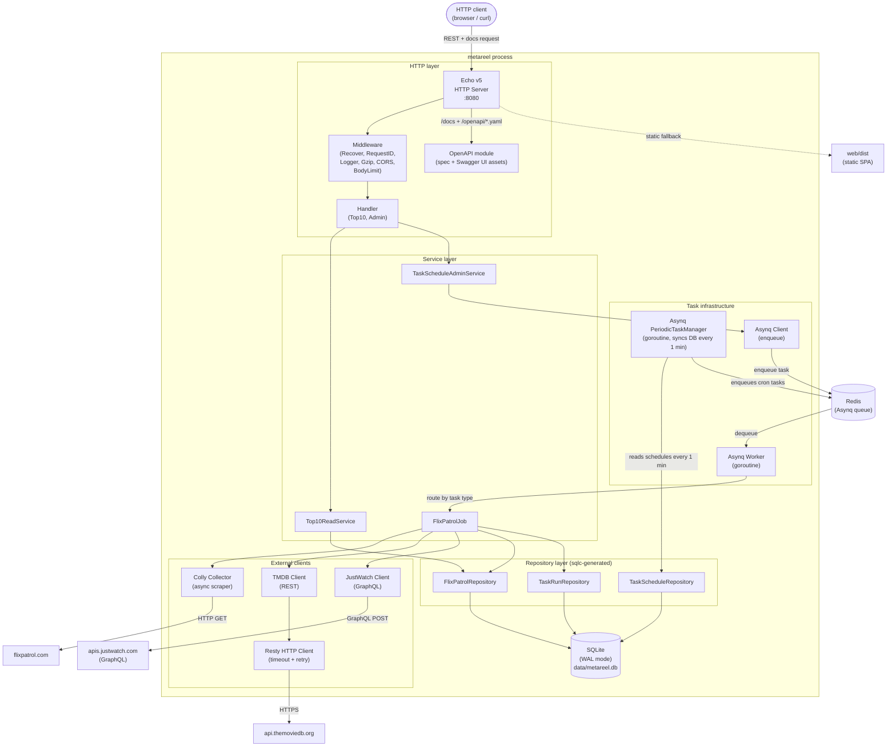
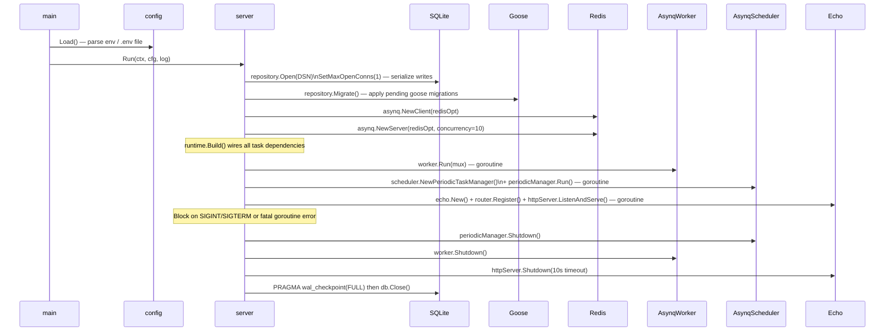
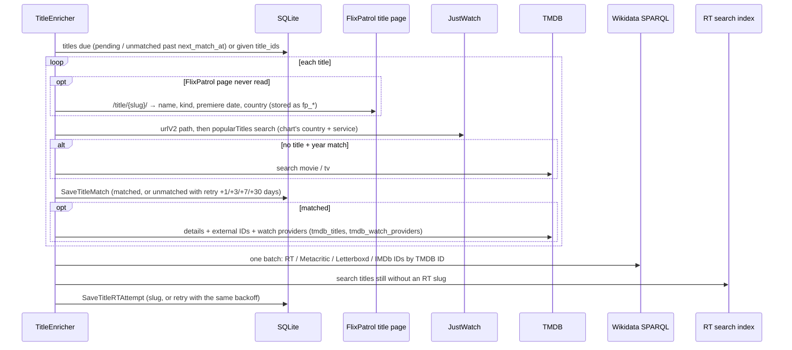
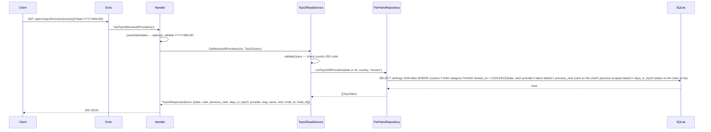
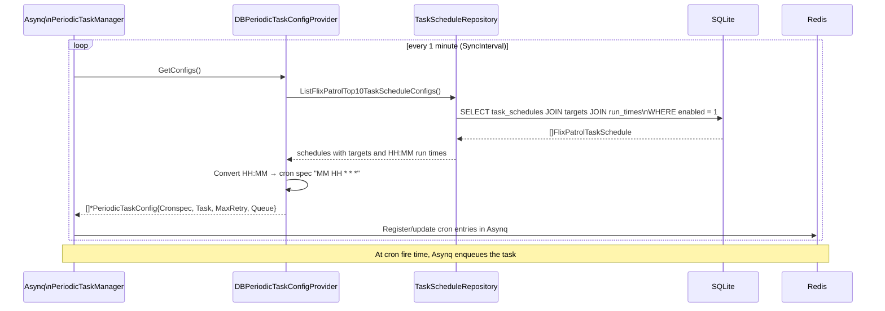
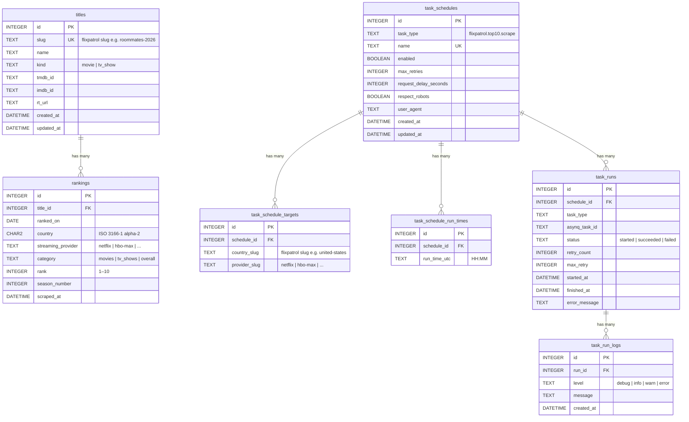

# metareel — Architecture

## Overview

metareel is a Go backend service that scrapes daily Top 10 streaming rankings from [FlixPatrol](https://flixpatrol.com), matches each title to TMDB / IMDb / Rotten Tomatoes (JustWatch GraphQL, TMDB, Wikidata SPARQL, RT's search index), adds TMDB metadata and watch providers, Netflix's official weekly Top 10 and IMDb's ratings dataset, persists everything in SQLite, and exposes a JSON REST API for charts, title performance, ratings, availability and analytics.

The HTTP contract is defined by embedded OpenAPI specs (`/openapi/public.yaml` and `/openapi/admin.yaml`) and served through Swagger UI (`/docs` and `/docs/admin`).

The service runs three concurrent subsystems in a single process:

| Subsystem | Role |
|---|---|
| **Echo HTTP server** | Serves the read API and admin endpoints |
| **Asynq worker** | Processes background scrape jobs pulled from Redis |
| **Asynq periodic task manager** | Reads cron schedules from the DB and enqueues jobs automatically |

---

## Component Architecture


```mermaid
graph TB
    subgraph process["metareel process"]
        subgraph http["HTTP layer"]
            Echo["Echo v5\nHTTP Server\n:8080"]
            MW["Middleware\n(Recover, RequestID,\nLogger, Gzip, CORS,\nBodyLimit)"]
            Handler["Handler\n(Top10, Admin)"]
            OpenAPI["OpenAPI module\n(spec + Swagger UI assets)"]
        end

        subgraph taskinfra["Task infrastructure"]
            Worker["Asynq Worker\n(goroutine)"]
            Scheduler["Asynq PeriodicTaskManager\n(goroutine, syncs DB every 1 min)"]
            AsynqClient["Asynq Client\n(enqueue)"]
        end

        subgraph services["Service layer"]
            Top10Svc["Top10ReadService"]
            AdminSvc["TaskScheduleAdminService"]
            FlixJob["FlixPatrolJob"]
        end

        subgraph clients["External clients"]
            Resty["Resty HTTP Client\n(timeout + retry)"]
            Colly["Colly Collector\n(async scraper)"]
            TMDB["TMDB Client\n(REST)"]
            JustWatch["JustWatch Client\n(GraphQL)"]
        end

        subgraph repo["Repository layer  (sqlc-generated)"]
            FlixRepo["FlixPatrolRepository"]
            ScheduleRepo["TaskScheduleRepository"]
            TaskRunRepo["TaskRunRepository"]
        end

        SQLite[("SQLite\n(WAL mode)\ndata/metareel.db")]
    end

    Redis[("Redis\n(Asynq queue)")]
    FlixPatrolSite["flixpatrol.com"]
    TMDBAPI["api.themoviedb.org"]
    JustWatchAPI["apis.justwatch.com\n(GraphQL)"]
    Client(["HTTP client\n(browser / curl)"])
    WebUI["web/dist\n(static SPA)"]

    Client -->|REST + docs request| Echo
    Echo --> MW --> Handler
    Echo -->|/docs + /openapi/*.yaml| OpenAPI
    Handler --> Top10Svc
    Handler --> AdminSvc
    AdminSvc --> AsynqClient
    AsynqClient -->|enqueue task| Redis

    Scheduler -->|reads schedules every 1 min| ScheduleRepo
    Scheduler -->|enqueues cron tasks| Redis
    Redis -->|dequeue| Worker
    Worker -->|route by task type| FlixJob

    Top10Svc --> FlixRepo
    FlixJob --> Colly
    FlixJob --> TMDB
    FlixJob --> JustWatch
    FlixJob --> FlixRepo
    FlixJob --> TaskRunRepo

    Colly -->|HTTP GET| FlixPatrolSite
    TMDB --> Resty -->|HTTPS| TMDBAPI
    JustWatch -->|GraphQL POST| JustWatchAPI

    FlixRepo --> SQLite
    ScheduleRepo --> SQLite
    TaskRunRepo --> SQLite

    Echo -.->|static fallback| WebUI
```

---

## Startup & Initialization Flow


```mermaid
sequenceDiagram
    participant main
    participant config
    participant server
    participant SQLite
    participant Goose
    participant Redis
    participant AsynqWorker
    participant AsynqScheduler
    participant Echo

    main->>config: Load() — parse env / .env file
    main->>server: Run(ctx, cfg, log)

    server->>SQLite: repository.Open(DSN)\nSetMaxOpenConns(1) — serialize writes
    server->>Goose: repository.Migrate() — apply pending goose migrations
    server->>Redis: asynq.NewClient(redisOpt)
    server->>Redis: asynq.NewServer(redisOpt, concurrency=10)

    Note over server: runtime.Build() wires all task dependencies
    server->>AsynqWorker: worker.Run(mux) — goroutine
    server->>AsynqScheduler: scheduler.NewPeriodicTaskManager()\n+ periodicManager.Run() — goroutine
    server->>Echo: echo.New() + router.Register() + httpServer.ListenAndServe() — goroutine

    Note over server: Block on SIGINT/SIGTERM or fatal goroutine error

    server->>AsynqScheduler: periodicManager.Shutdown()
    server->>AsynqWorker: worker.Shutdown()
    server->>Echo: httpServer.Shutdown(10s timeout)
    server->>SQLite: PRAGMA wal_checkpoint(FULL) then db.Close()
```

---

## Jobs

Every background job is an asynq task type run from a DB schedule
(`task_schedules.task_type`) or on demand (`POST /api/v1/admin/jobs/:type/run`,
`/backfill`, a schedule's run-now). `tasks.ForSchedule` builds the task and its
options for both paths; every task is enqueued with `asynq.Unique`, so the same
run can't be queued twice (409 from the API). `handlers.Runner` records each
attempt in `task_runs` (status `started | succeeded | partial | failed`,
target counts, JSON `summary`) and `task_run_logs`, and posts an alert when the
last attempt fails (`ALERT_WEBHOOK_URL`). Ad-hoc runs have no `schedule_id`.

| Task type | Service | Notes |
|---|---|---|
| `flixpatrol.top10.scrape` | `FlixPatrolJob` | Charts only; enqueues `titles.enrich` for new titles and hourly re-checks for unpublished charts |
| `titles.enrich` | `TitleEnricher` (+ `TitleMatcher`) | Matching with backoff, RT via Wikidata then search |
| `titles.metadata` | `TitleMetadataService` | TMDB details + watch providers, Wikidata IDs |
| `ratings.prewarm` | `RatingsService.Prewarm` | Charting titles' expired ratings |
| `netflix.top10.import` | `NetflixImporter` | Netflix TSVs, Netflix title matching |
| `imdb.ratings.import` | `IMDbImporter` | IMDb `title.ratings.tsv.gz` |
| `maintenance` | `MaintenanceService` | Retention, stale-chart alerts, `PRAGMA optimize` |

FlixPatrol fetches from every job go through one `flixpatrol.SerialFetcher`:
one page at a time, `SCRAPER_MIN_INTERVAL` apart.

## Scrape Job Flow

```mermaid
sequenceDiagram
    participant Trigger as Scheduler / run-now / backfill
    participant Worker as FlixPatrolHandler
    participant Job as FlixPatrolJob
    participant FP as FlixPatrol (via FlareSolverr)
    participant DB as SQLite
    participant Q as asynq

    Trigger->>Worker: flixpatrol.top10.scrape {targets, backfill_days, recheck_hours | dates}
    Worker->>DB: task_runs (started)
    Job->>FP: fetcher health check (all targets fail fast if down)
    loop each target × date (gaps from the last backfill_days, then today; oldest first)
        Job->>DB: chart_snapshots for date? → skip if both categories stored
        Job->>FP: GET /top10/{provider}/{country}/{date}/
        alt same content as the previous stored date and re-check window open
            Note over Job: not_fresh: not stored
        else
            Job->>DB: EnsureTitle per entry (new titles: match_status pending)
            Job->>DB: SaveChart (one transaction: delete chart, insert ranks + season numbers, upsert chart_snapshots)
        end
        Note over Job: 3 consecutive fetch failures stop the remaining pages
    end
    Worker->>Q: titles.enrich {title_ids: new titles}
    Worker->>Q: re-check not_fresh targets in 1h (until recheck deadline)
    Worker->>DB: task_runs (succeeded | partial | failed, counts, per-target summary)
    Note over Worker: failed pages → error → asynq retry; stored charts are skipped
```

## Title Matching Flow (`titles.enrich`)


```mermaid
sequenceDiagram
    participant E as TitleEnricher
    participant DB as SQLite
    participant FP as FlixPatrol title page
    participant JW as JustWatch
    participant TMDB
    participant WD as Wikidata SPARQL
    participant RT as RT search index

    E->>DB: titles due (pending / unmatched past next_match_at) or given title_ids
    loop each title
        opt FlixPatrol page never read
            E->>FP: /title/{slug}/ → name, kind, premiere date, country (stored as fp_*)
        end
        E->>JW: urlV2 path, then popularTitles search (chart's country + service)
        alt no title + year match
            E->>TMDB: search movie / tv
        end
        E->>DB: SaveTitleMatch (matched, or unmatched with retry +1/+3/+7/+30 days)
        opt matched
            E->>TMDB: details + external IDs + watch providers (tmdb_titles, tmdb_watch_providers)
        end
    end
    E->>WD: one batch: RT / Metacritic / Letterboxd / IMDb IDs by TMDB ID
    E->>RT: search titles still without an RT slug
    E->>DB: SaveTitleRTAttempt (slug, or retry with the same backoff)
```

`manual` titles (fixed in the admin UI) are never changed by automation.
`POST /api/v1/admin/titles/:id/rematch` clears the backoff (and with
`clear: true`, the IDs) and queues the title.

## Read API Flow


```mermaid
sequenceDiagram
    participant Client
    participant Echo
    participant Handler
    participant Top10Svc as Top10ReadService
    participant FlixRepo as FlixPatrolRepository
    participant SQLite

    Client->>Echo: GET /api/v1/top10/movies/{country}[?date=YYYY-MM-DD]
    Echo->>Handler: GetTop10MoviesAllProviders(c)
    Handler->>Handler: parseDate(date) — optional, validate YYYY-MM-DD
    Handler->>Top10Svc: GetMoviesAllProviders(ctx, Top10Query)
    Top10Svc->>Top10Svc: validateQuery — check country ISO code
    Top10Svc->>FlixRepo: ListTop10AllProviders(date or nil, country, "movies")
    FlixRepo->>SQLite: SELECT rankings JOIN titles WHERE country=? AND category=?\nAND ranked_on = COALESCE(date, each provider's latest date)\n+ previous_rank (rank on the chart's previous scraped date)\n+ days_in_top10 (dates on the chart so far)
    SQLite-->>FlixRepo: rows
    FlixRepo-->>Top10Svc: []Top10Item
    Top10Svc-->>Handler: *Top10Response{items: [{date, rank, previous_rank, days_in_top10, provider, slug, name, kind, tmdb_id, imdb_id}]}
    Handler-->>Client: 200 JSON
```

`kind` on a chart entry is what the title is (and so the TMDB namespace of
`tmdb_id`), which can differ from the chart's category: a stand-up special
in the TV chart is usually a movie on FlixPatrol's title page, JustWatch and
TMDB. The scraper tries the title page's kind first, then the chart's.

Ranking history (`GET /api/v1/titles/tmdb/{movie|tv}/{id}/rankings`, and the
batch `GET /api/v1/titles/tmdb/rankings?ids=movie:425,tv:154385`) looks up
every title row with that TMDB ID and kind, then returns its chart
appearances and a per-chart summary.

---

## Ratings Flow

`GET /api/v1/titles/tmdb/{movie|tv}/{id}/ratings` serves `title_ratings` +
`title_rating_sources` if refreshed within `RATINGS_TTL`; otherwise (or with
`?refresh=true`) it refreshes, collapsing concurrent refreshes of one title:

```mermaid
sequenceDiagram
    participant Svc as RatingsService
    participant DB as SQLite
    participant MDB as MDBList
    participant TMDB
    participant JW as JustWatch
    participant RT as RT Algolia index

    Svc->>DB: title_ratings (stored JustWatch ID, RT slug, name, year)<br/>+ titles with this TMDB ID (name, imdb_id, rt_url)
    opt MDBLIST_API_KEY set
        Svc->>MDB: GET /tmdb/{movie|show}/{id}
        MDB-->>Svc: title, year, imdb_id, all ratings (+ RT link → slug hint)
    end
    opt name still unknown && TMDB_API_KEY set
        Svc->>TMDB: GET /{movie|tv}/{id}
    end
    Svc->>JW: node(stored id), else search name → match TMDB ID
    JW-->>Svc: imdb score/votes, tomatoMeter, certifiedFresh, tmdb, jwRating
    Svc->>RT: search by slug (stored / titles.rt_url / MDBList link) → exact vanity hit
    alt no slug hit
        Svc->>RT: Seerr-style search: title similarity × year closeness
    end
    Svc->>DB: upsert title_ratings; replace each successful provider's sources;<br/>back-fill titles.imdb_id / rt_url
```

Headline values: IMDb from the preferred provider (then the other); RT
critics / audience / Certified Fresh from RT itself, falling back to the
preferred provider, then the other. Providers that fail keep their previous
rows; if every provider fails, stored ratings are returned with `stale: true`.

---

## Periodic Schedule Sync Flow

The PeriodicTaskManager polls the DB every minute and adjusts the Asynq cron schedule dynamically, without restarts.


```mermaid
sequenceDiagram
    participant AsynqScheduler as Asynq\nPeriodicTaskManager
    participant DBProvider as DBPeriodicTaskConfigProvider
    participant ScheduleRepo as TaskScheduleRepository
    participant SQLite
    participant Redis

    loop every 1 minute (SyncInterval)
        AsynqScheduler->>DBProvider: GetConfigs()
        DBProvider->>ScheduleRepo: ListFlixPatrolTop10TaskScheduleConfigs()
        ScheduleRepo->>SQLite: SELECT task_schedules JOIN targets JOIN run_times\nWHERE enabled = 1
        SQLite-->>ScheduleRepo: []FlixPatrolTaskSchedule
        ScheduleRepo-->>DBProvider: schedules with targets and HH:MM run times
        DBProvider->>DBProvider: Convert HH:MM → cron spec "MM HH * * *"
        DBProvider-->>AsynqScheduler: []*PeriodicTaskConfig{Cronspec, Task, MaxRetry, Queue}
        AsynqScheduler->>Redis: Register/update cron entries in Asynq
    end

    Note over AsynqScheduler,Redis: At cron fire time, Asynq enqueues the task
```

---

## Database Schema

A single SQLite file (`data/metareel.db`, WAL mode). Chart dates
(`rankings.ranked_on`, `chart_snapshots.ranked_on`, Netflix `week`) are plain
ISO `YYYY-MM-DD` text so SQLite's date functions work; bind them as strings
(`repository.FormatDate`), never `time.Time`.

Added since the diagram below:

| Table | Purpose |
|---|---|
| `chart_snapshots` | One row per stored chart (date × country × provider × category): entry count, content `signature`, `scraped_at`, `changed_at` |
| `titles` (new columns) | `match_status` (pending / matched / unmatched / manual), `match_source`, `matched_name/year`, `match_attempts`, `next_match_at`, `rt_attempts`, `next_rt_at`, `justwatch_id`, `wikidata_id`, `fp_*` (FlixPatrol title page) |
| `tmdb_titles` | TMDB metadata per TMDB title + Wikidata IDs (RT, Metacritic, Letterboxd) |
| `tmdb_watch_providers` | Watch providers per title × country × monetization |
| `netflix_titles`, `netflix_top10_global`, `netflix_top10_countries`, `netflix_most_popular` | Netflix's official Top 10 and their TMDB matches |
| `imdb_ratings` | IMDb dataset ratings (known IMDb IDs by default) |
| `data_imports` | Last imported ETag / Last-Modified per file |
| `task_schedules` (new columns) | `backfill_days`, `recheck_hours`; `task_type` validated in Go |
| `task_runs` (new columns) | nullable `schedule_id`, `targets_*` counts, `summary` JSON; status adds `partial` |


```mermaid
erDiagram
    titles {
        INTEGER id PK
        TEXT slug UK "flixpatrol slug e.g. roommates-2026"
        TEXT name
        TEXT kind "movie | tv_show"
        TEXT tmdb_id
        TEXT imdb_id
        TEXT rt_url
        DATETIME created_at
        DATETIME updated_at
    }

    rankings {
        INTEGER id PK
        INTEGER title_id FK
        DATE ranked_on
        CHAR2 country "ISO 3166-1 alpha-2"
        TEXT streaming_provider "netflix | hbo-max | ..."
        TEXT category "movies | tv_shows | overall"
        INTEGER rank "1–10"
        INTEGER season_number
        DATETIME scraped_at
    }

    task_schedules {
        INTEGER id PK
        TEXT task_type "flixpatrol.top10.scrape"
        TEXT name UK
        BOOLEAN enabled
        INTEGER max_retries
        INTEGER request_delay_seconds
        BOOLEAN respect_robots
        TEXT user_agent
        DATETIME created_at
        DATETIME updated_at
    }

    task_schedule_targets {
        INTEGER id PK
        INTEGER schedule_id FK
        TEXT country_slug "flixpatrol slug e.g. united-states"
        TEXT provider_slug "netflix | hbo-max | ..."
    }

    task_schedule_run_times {
        INTEGER id PK
        INTEGER schedule_id FK
        TEXT run_time_utc "HH:MM"
    }

    task_runs {
        INTEGER id PK
        INTEGER schedule_id FK
        TEXT task_type
        TEXT asynq_task_id
        TEXT status "started | succeeded | failed"
        INTEGER retry_count
        INTEGER max_retry
        DATETIME started_at
        DATETIME finished_at
        TEXT error_message
    }

    task_run_logs {
        INTEGER id PK
        INTEGER run_id FK
        TEXT level "debug | info | warn | error"
        TEXT message
        DATETIME created_at
    }

    titles ||--o{ rankings : "has many"
    task_schedules ||--o{ task_schedule_targets : "has many"
    task_schedules ||--o{ task_schedule_run_times : "has many"
    task_schedules ||--o{ task_runs : "has many"
    task_runs ||--o{ task_run_logs : "has many"
```

Key constraints:
- `rankings` has a unique index on `(ranked_on, country, streaming_provider, category, rank)` — upserts replace stale title references cleanly.
- `titles` is keyed on `slug` (FlixPatrol URL slug). TMDB/IMDb IDs are filled in lazily and only overwrite `NULL`.
- `task_schedules.name` is unique — the admin API returns `409 Conflict` on duplicates.
- SQLite connection pool is capped at 1 (`SetMaxOpenConns(1)`) to serialize writes; WAL mode allows concurrent reads alongside the single writer.

---

## API Contract

The API reference is OpenAPI-first and is not duplicated in this architecture document.

- Public spec (YAML): `GET /openapi/public.yaml`
- Admin spec (YAML): `GET /openapi/admin.yaml`
- Public Swagger UI: `GET /docs`
- Admin Swagger UI: `GET /docs/admin`

Implementation note: both YAML specs and Swagger UI HTML are embedded from `internal/openapi/` into the server binary.

---

## Direct Dependencies

### Runtime dependencies (`go.mod` direct requires)

| Package | Version | Role |
|---|---|---|
| `github.com/labstack/echo/v5` | v5.1.0 | HTTP server and router |
| `github.com/hibiken/asynq` | v0.26.0 | Redis-backed background task queue and scheduler |
| `github.com/redis/go-redis/v9` | v9.18.0 | Redis client (used by `asynq` and the cache wrapper) |
| `github.com/gocolly/colly/v2` | v2.3.0 | Web scraping framework (async, robots.txt, rate limiting) |
| `github.com/PuerkitoBio/goquery` | v1.11.0 | jQuery-style HTML parsing (used inside Colly callbacks) |
| `github.com/go-resty/resty/v2` | v2.17.2 | HTTP client with retry and timeout for external REST APIs |
| `github.com/hasura/go-graphql-client` | v0.16.0 | GraphQL client for the JustWatch API |
| `modernc.org/sqlite` | v1.49.1 | Pure-Go SQLite driver (no CGO — enables fully static binary) |
| `github.com/pressly/goose/v3` | v3.27.0 | SQL migration runner (up/down, versioned files) |
| `github.com/caarlos0/env/v11` | v11.4.0 | Struct-tag-based environment variable parsing |
| `github.com/joho/godotenv` | v1.5.1 | Loads `.env` file into the process environment at startup |

### Dev-only dependencies (`tools/go.mod`)

| Package | Role |
|---|---|
| `github.com/air-verse/air` | Hot-reload server (`make dev-server-air`) |
| `github.com/go-delve/delve` | Local debugger backend for attach/launch workflows |
| `github.com/hibiken/asynqmon` | Web UI for inspecting Asynq queues (`make dev-asynqmon`) |
| `github.com/alicebob/miniredis/v2` | In-process Redis for local dev (`make dev-redis-up`) |

### Code generation tools (installed via `make tools`)

| Tool | Role |
|---|---|
| `github.com/sqlc-dev/sqlc` | Generates type-safe Go from `db/queries/*.sql` |
| `github.com/pressly/goose/v3` CLI | Runs migrations from the terminal (`make migrate-*`) |

### Standard library packages used

`context`, `database/sql`, `encoding/json`, `log/slog`, `net/http`, `os`, `os/signal`, `sync`, `syscall`, `time`

---

## Configuration Reference

All config is loaded from environment variables (with `.env` auto-loaded in development). See `.env.example` for the complete list.

| Variable | Default | Description |
|---|---|---|
| `APP_ENV` | `development` | Environment tag |
| `SERVER_HOST` | `0.0.0.0` | Bind address |
| `SERVER_PORT` | `8080` | Listen port |
| `SERVER_READ_TIMEOUT` | `15s` | Echo read timeout |
| `SERVER_WRITE_TIMEOUT` | `15s` | Echo write timeout |
| `SERVER_SHUTDOWN_TIMEOUT` | `10s` | Graceful shutdown window |
| `LOG_LEVEL` | `info` | `debug` / `info` / `warn` / `error` |
| `DATABASE_URL` | `file:./data/metareel.db?...` | SQLite DSN (WAL + busy timeout + FK enforcement) |
| `DATABASE_MIGRATIONS_DIR` | `db/migrations` | Goose migrations directory |
| `REDIS_ADDR` | `localhost:6379` | Redis address |
| `REDIS_PASSWORD` | _(empty)_ | Redis auth password |
| `REDIS_DB` | `0` | Redis logical DB index |
| `REDIS_DEFAULT_TTL` | `5m` | Default cache TTL |
| `ASYNQ_QUEUE` | `default` | Asynq queue name |
| `ASYNQ_CONCURRENCY` | `10` | Asynq worker goroutine count |
| `HTTP_CLIENT_TIMEOUT` | `20s` | Resty request timeout |
| `HTTP_CLIENT_RETRY_COUNT` | `2` | Resty auto-retry count on 5xx / network error |
| `HTTP_CLIENT_USER_AGENT` | `metareel/0.1` | User-Agent for TMDB + JustWatch requests |
| `SCRAPER_USER_AGENT` | `metareel-bot/0.1` | Colly User-Agent header |
| `SCRAPER_PARALLELISM` | `4` | Colly concurrent requests per domain |
| `SCRAPER_REQUEST_TIMEOUT` | `20s` | Colly per-request timeout |
| `FLARESOLVERR_URL` | _(empty)_ | FlareSolverr base URL (e.g. `http://flaresolverr:8191`); when set, FlixPatrol pages are fetched through it instead of Colly |
| `FLARESOLVERR_MAX_TIMEOUT` | `60s` | Max time FlareSolverr may spend on one page |
| `FLARESOLVERR_SESSION` | `metareel` | FlareSolverr browser session reused across requests (blank = new browser per page) |
| `FLARESOLVERR_SESSION_TTL` | `30m` | FlareSolverr recreates the session after this long |
| `UI_STATIC_DIR` | `web/dist` | Directory to serve the SPA from |
| `UI_SERVE_STATIC` | `true` | Enable / disable static file serving |
| `TMDB_API_KEY` | _(empty)_ | TMDB v3 API key — ID enrichment disabled when blank |
| `RATINGS_TTL` | `12h` | How long stored ratings are served before a request refreshes them |
| `RATINGS_PREFERRED_PROVIDER` | `justwatch` | `justwatch` or `mdblist`: wins when both have an IMDb / RT value |
| `MDBLIST_API_KEY` | _(empty)_ | Enables MDBList as a ratings provider |
| `SCRAPER_MIN_INTERVAL` | `2s` | Minimum gap between FlixPatrol page fetches across all jobs |
| `NETFLIX_TOP10_COUNTRIES` | _(empty)_ | Netflix per-country Top 10 to keep: ISO codes, empty = the FlixPatrol schedules' countries, `all` = every country |
| `IMDB_DATASET_SCOPE` | `known` | `known` = only IMDb IDs metareel has, `all` = the whole dataset (~1.6M rows) |
| `DOWNLOAD_TIMEOUT` | `10m` | One Netflix / IMDb file download |
| `ALERT_WEBHOOK_URL` | _(empty)_ | Webhook for failed runs and stale charts (contains a secret for some services; never logged) |
| `ALERT_WEBHOOK_FORMAT` | `json` | `json`, `slack`, `discord` or `ntfy` |
| `ALERT_STALE_CHART_HOURS` | `24` | Alert when a scheduled chart's next date has been due this long |
| `ALERT_COOLDOWN` | `12h` | Minimum time between repeats of one alert |
| `RUN_RETENTION_DAYS` | `90` | The maintenance job deletes older task runs and logs |

---

## Project Layout

```
metareel/
├── cmd/
│   └── server/
│       └── main.go               # Entrypoint — loads config, calls server.Run
├── internal/
│   ├── client/
│   │   ├── resty.go              # Resty factory (timeout, retry, headers)
│   │   ├── tmdb.go               # TMDB REST client (search + external IDs)
│   │   ├── tmdb_details.go       # TMDB details + external IDs + watch providers (one call)
│   │   ├── justwatch.go          # JustWatch GraphQL client (title ID lookup)
│   │   ├── wikidata_sparql.go    # Wikidata SPARQL batch lookup (RT, Metacritic, Letterboxd, IMDb)
│   │   └── download.go           # Netflix / IMDb file downloads, skipped when unchanged
│   ├── config/
│   │   └── config.go             # Config struct + Load() via caarlos0/env
│   ├── constants/
│   │   └── iso3166.go            # ISO 3166-1 alpha-2 country code enum
│   ├── handler/
│   │   └── handler.go            # Echo handlers + request parsing + error mapping
│   ├── openapi/
│   │   ├── openapi.go            # Embedded OpenAPI YAML + Swagger UI helpers
│   │   ├── spec/                 # public/admin OpenAPI specs
│   │   └── swaggerui/            # Embedded Swagger UI HTML templates
│   ├── repository/
│   │   ├── repository.go         # DB open + Goose migration bootstrap
│   │   ├── flixpatrol_repo.go    # Title + ranking upserts
│   │   ├── task_schedule_repo.go # Schedule CRUD + target management
│   │   ├── task_run_repo.go      # Task run + log persistence
│   │   ├── top10_read_repo.go    # Top 10 read queries
│   │   └── sqlc/                 # sqlc-generated code (do not edit)
│   ├── router/
│   │   └── router.go             # Route registration + middleware + static SPA
│   ├── scheduler/
│   │   ├── manager.go            # Asynq PeriodicTaskManager factory
│   │   └── provider.go           # DBPeriodicTaskConfigProvider (DB → cron specs)
│   ├── scraper/
│   │   ├── colly.go              # Colly collector factory (rate limit, async)
│   │   └── flixpatrol/
│   │       ├── scraper.go        # Top10URL builder + ScrapeTop10 + HTML parser
│   │       └── country.go        # FlixPatrol slug ↔ ISO 3166-1 alpha-2 mapping
│   ├── server/
│   │   └── server.go             # Dependency wiring + graceful shutdown
│   ├── service/
│   │   ├── flixpatrol_job.go      # Chart scrape (gaps, freshness, partial runs)
│   │   ├── title_matcher.go       # FlixPatrol title → TMDB / IMDb / RT matching
│   │   ├── title_enrich.go        # titles.enrich job (matching backlog + RT)
│   │   ├── title_metadata.go      # titles.metadata job (TMDB + Wikidata)
│   │   ├── netflix_import.go      # Netflix official Top 10 import + matching
│   │   ├── imdb_import.go         # IMDb ratings dataset import
│   │   ├── charts.go              # catalog, history, movers, leaderboards, changes, export
│   │   ├── title_overview.go      # title overview, stats, availability, lookup
│   │   ├── analytics.go           # decay, similarity, release lag, ratings vs popularity, genres, Netflix calibration
│   │   ├── data_quality.go        # admin data-quality report
│   │   ├── maintenance.go, alerts.go, health.go
│   │   ├── task_schedule_admin.go # Admin CRUD + manual task enqueue
│   │   ├── title_admin.go         # Title metadata patch/update service
│   │   └── top10_read.go          # Read-only Top 10 query service
│   └── tasks/
│       ├── definition.go          # Task type constants + payload structs + constructors
│       ├── schedule.go            # schedule → task + enqueue options (Unique)
│       ├── handlers/
│       │   ├── runner.go          # task_runs / logs / alerts for every job
│       │   ├── jobs.go            # non-FlixPatrol job handlers
│       │   ├── flixpatrol.go      # Asynq handler: run scrape → queue matching / re-checks
│       │   └── mux.go             # Asynq ServeMux builder
│       └── runtime/
│           └── bootstrap.go       # Wires all task dependencies into a Bootstrap struct
├── db/
│   ├── migrations/
│   │   └── 000001_init.sql       # Full schema (titles, rankings, task_* tables)
│   └── queries/                  # sqlc input files (one per domain)
├── web/
│   └── dist/                     # Built SPA assets (not committed; mount or copy in)
├── tools/
│   ├── go.mod                    # Isolated dev tool deps (air, asynqmon, miniredis)
│   └── cmd/devredis/main.go      # In-process miniredis server for local dev
├── .air.run.toml                 # Air run profile (hot reload only)
├── .air.debug.toml               # Air debug profile (hot reload + Delve)
├── Dockerfile                    # Multi-stage; final stage: scratch + static binary
├── docker-compose.yml            # server + redis (128 MB / 160 MB memory caps)
├── Makefile                      # All developer workflows
└── sqlc.yaml                     # sqlc codegen config
```

---

## Key Design Decisions

**Pure-Go SQLite (`modernc.org/sqlite`)**
No CGO dependency means the final Docker image is built on `scratch` and is fully static (~15–20 MB). The trade-off is that `modernc` is slightly slower than `mattn/go-sqlite3` for high-throughput write workloads — acceptable here since rankings are written by background jobs, not hot paths.

**Single SQLite writer connection**
`SetMaxOpenConns(1)` serializes all writes. Combined with WAL mode (reads don't block the writer), this eliminates `SQLITE_BUSY` under concurrent API + worker load without needing a mutex.

**Asynq over a simpler cron package**
Asynq gives persistent, Redis-backed job state, retries with backoff, task deduplication, and the `PeriodicTaskManager` which can reload schedules from the DB every minute — meaning schedule changes take effect without a restart.

**Scrapes store charts; matching is a separate job**
A scrape fetches only chart pages, so it is quick and a slow or failing
upstream (JustWatch, TMDB, RT) can't stall or fail it. New titles are matched
by `titles.enrich` straight after; unmatched titles back off (1, 3, 7, 30
days) instead of costing lookups on every scrape.

**JustWatch-first, TMDB-fallback ID matching**
JustWatch returns both TMDB and IMDb IDs in a single call. TMDB is only queried if JustWatch fails, reducing external API rate-limit exposure.

**Partial runs and idempotent retries**
A failed chart page doesn't stop a run; the run is `partial` and asynq
retries it. Charts already stored for the date are skipped, so a retry only
fetches what failed.

**WAL checkpoint on shutdown**
`PRAGMA wal_checkpoint(FULL)` merges the write-ahead log into the main database file before closing. This ensures that any tool or backup script that opens only `metareel.db` (not the `-wal`/`-shm` side files) sees fully committed data.
